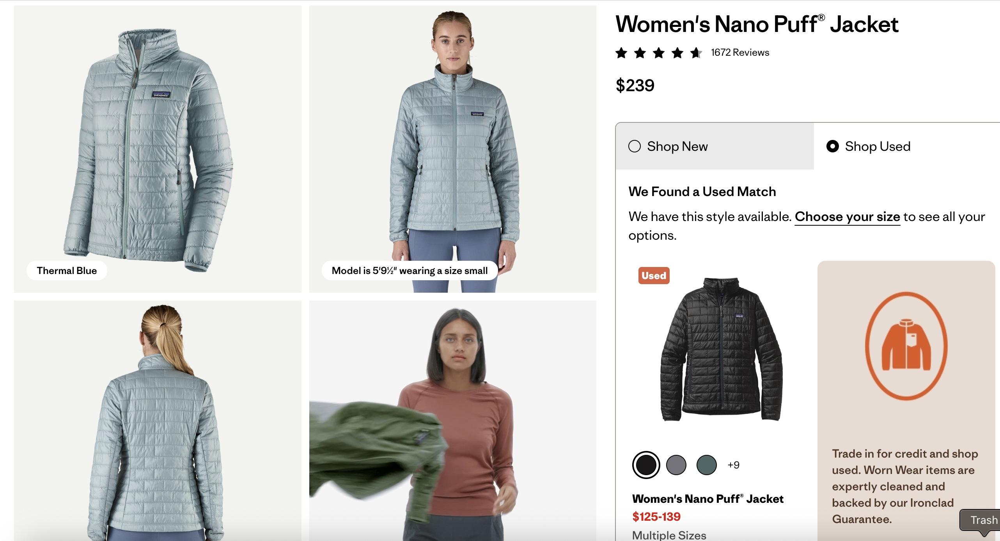
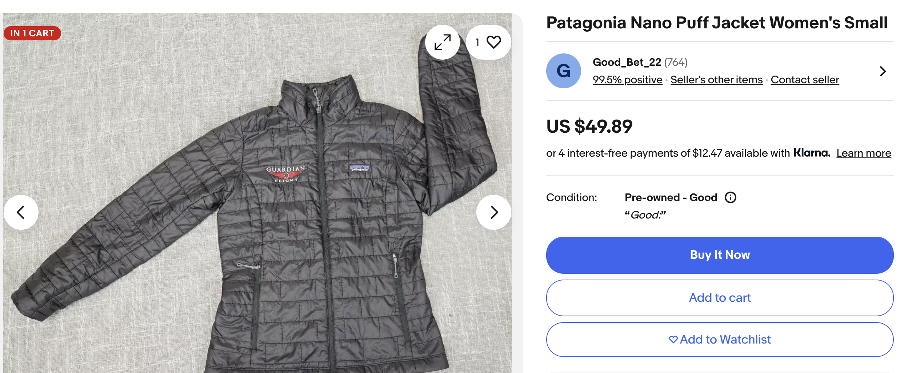
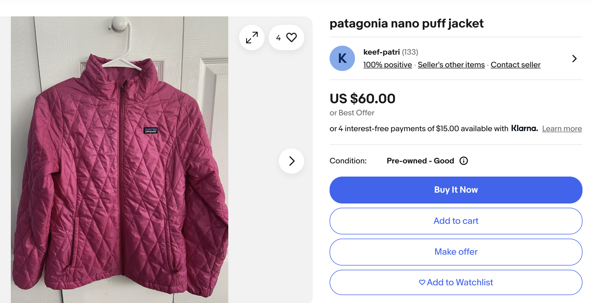
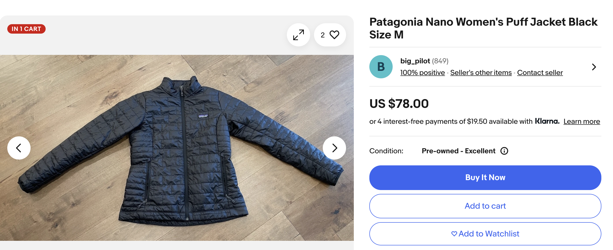

# ResaleMarketplace

A Python tool for finding similar clothing items across retail and resale platforms, helping users find better deals. Given a retail product item, the application returns a CSV file of similar products on eBay sorted by price. 

The ResaleMarketplaceMatcher application provides a text similarity-based matching analysis that compares clothing items from retail websites with similar items on eBay. The system uses natural language processing and machine learning techniques to find the most similar items based on product descriptions.

The repository was recently organized according to software development standards and modified based on changes to the eBay API prior to uploading to GitHub.

## Background

This project was apart of a Winter Data Competition in 2020 while I was in graduate school at [Duke University](https://www.fuqua.duke.edu/programs/mqm-business-analytics). Given an open-ended deliverable, the competition was to deliver an interesting data science project and present the findings on a [LinkedIn post](https://www.linkedin.com/pulse/exploring-resale-marketplace-online-max-gordon/). 

Including this project, a panel of judges selected 5 projects based on LinkedIn posts for the competition to present their project and findings in-person. Utimately, this project [won first place](https://www.linkedin.com/posts/eric-soden_mike-activity-6628517267023937536-t-7K?utm_source=social_share_send&utm_medium=member_desktop_web&rcm=ACoAAB4dAnAB7cCvi-FvbatYDzZz8hB3-KPGsKQ) in the Winter Data Competition.

## Technical Features
- Text cleaning and normalization using NLTK
- TF-IDF vectorization and cosine similarity scoring for text similarity
- Integration with eBay API for resale marketplace

## Sample Results

### Retail Product Page
Following a similar example from the Winter Data Competition post, I found a product page for Women's Nano Puff Jacket on Patagonia. 

### Implementation 
After creating an eBay developer application, I inputted the product title *Women's Nano Puff® Jacket* into the `resale_marketplace_matcher_execution` package with an access token to the eBay API. 

Before executing, I adjusted the `cosine_similarity_threshold` to only return items with a cosine similarity score `>=0.6` and limited the number of items to request from eBay to be `5000`. 

### Resale Comparisons
Approximately 50 eBay products were returned and saved as a CSV in the `results/similar_resale_products_sorted.csv` directory. Sorted by lowest price, spot checking a few products on eBay below:

### Conclusion
Even when comparing eBay products against the `Shop Used` option on the Patagonia product page, the resale items from eBay shown above are roughly half the price of the used options on Patagonia. 

These sample products above are from sellers with review scores all over 99% and have over 100 reviewers each. The application could be easily improved by adding size and color as a component for similarity score to display preferred results. 

## Future Improvements

### Testing and error handling
- Add more unit and integration tests for eBay API package and clothing similarity matching package
- Improve error handling and logging metrics for failed executions (malformed data from eBay API, etc.)

### Feature Implementations
- Add support for image similarity matching using eBay `searchByImage` API endpoint
- Implement weighted similarity scoring given resaler reviews or item features such as product size or color. 
- Add support for more resale platforms (PoshMark, ThredUp, etc.)
- Create a web interface via a Chrome extension to display resale options in real-time